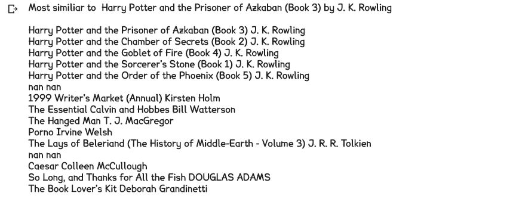

# BookCrossingsRecommender

Recommender system built from BookCrossings data

This is my attempt at making a book recommender from BookCrossings dataset (found here http://www2.informatik.uni-freiburg.de/~cziegler/BX/) using a word2vec-based model; embeddings are trained to represent each book. 

Each data point consists of a book (title and author), a rating given by a user, and the ID of the user. Data points are grouped by user. In word2vec, the 'neighbors' of any particular word are words that appear in a certain proximity of that word in a sentence (more elegantly explained here https://www.youtube.com/watch?v=xMwx2A_o5r4 ). In training embeddings to represent books, the 'neighbors' for any particular book of a data point are all other books rated by the same user. 

# Results

This attempt was not very successful to me as the recommendations generated did not seem robust to me, but I am glad I attempted this project as it gave me deeper insight into training embeddings. 

I think the reason why the embeddings were not very robust is that there were not enough data points for each book. After removing instances of data points where there was only one book or one user in the training data, there was 40,987 books and 211,322 data points. 

I performed a similar training/analysis (found here https://github.com/Santosh-Gupta/Book2Vec ) on the Goodreads dataset set ( found here https://github.com/zygmuntz/goodbooks-10k ), which had 10,000 books and over 4 million data points after filtering. The recommendations generated by those embeddings are much more robust. I suspect having much more training data for each embedding was the main factor in the better embeddings. That doesn't mean there isn't a way to produce good ratings from the data using embeddings; there still could be a way to tinker with the raw data and training hyperparameters to produce good reccomendations. 

Rating the the embeddings is a bit subjective since the traditional method of having separate sets for validation and testing doesn't really apply for embeddings, since embeddings can't be produced without training. There are usually evaluation suites developed for evaluating embeddings, but none have been produced in evaluating embeddings that represent books. 

There are some subjective ways of evaluating the embeddings. For each book, you can attribute a few properties. For example, for Harry Potter, you can attribute the properties of 1) Children's/Young adult 2) Fantasy. So it would be expected that the books whose embeddings are most similar to Harry Potter's book embeddings would also have these properties. However, this isn't quite the case. 

The books closest to the 3rd Harry Potter Book in the series were other Harry Potter books, which is a good sign. But outside of Calvin and Hobbes, none of those seem like good recommendations for Harry Potter. I checked the recommended books for Harry Potter and the Prisoner of Azkaban on Amazon and Goodreads, and none of those were in the recommendations. 

Of course, there are 40,886 other books to evaluate, but evaluating all those books would be very time-consuming. A way to evaluate a large number of books is are TSNE visualizations, which maps the embeddings into a 2D or 3D spaces where embeddings that are most similar to each other are plottings close to each other in the visualization. 

I performed a TSNE of the most occurring 3000 books for both the input embeddings and the softmax embeddings. For both sets of embeddings, the maps did not really make much sense to me. (you probably have to download these, open them up, and zoom in to read the maps)

Input embeddings TSNE

Softmax embeddings TSNE

I am glad I attempted to make a recommender from this dataset though. This gave me a deeper intuition on the volume of data needed for robust book embeddings, since the Goodreads dataset resulted is very robust embeddings. 

Again, if you would like to see a successful application of Book Embeddings, please see my other project https://github.com/Santosh-Gupta/Book2Vec . 

# Methods

The BookCrossingsTraining.ipynb notebook explores and filters the raw data. All ratings below a '6' are removed since we only want to group books where the reader had an enjoyable experience (since the embeddings will be used for recommendations). I would prefer to filter ratings below a 7 or 8 but due to the low volume of data, I tried to preserve as many data points as possible. All books and users that appear less than 2 times are also removed. Again, I would prefer to have a higher filter but I was trying to preserve as many data points as possible. 

